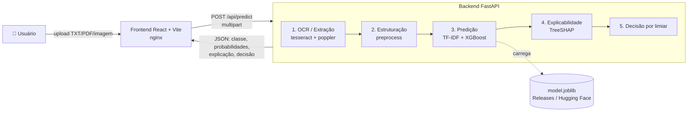
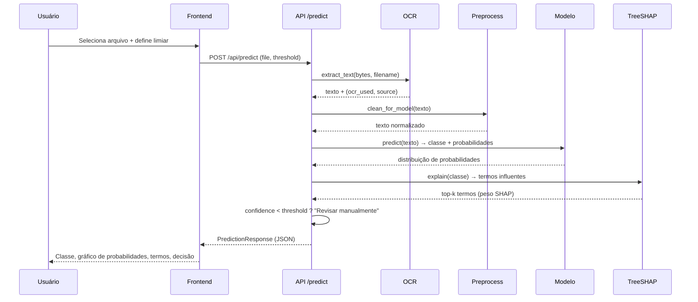
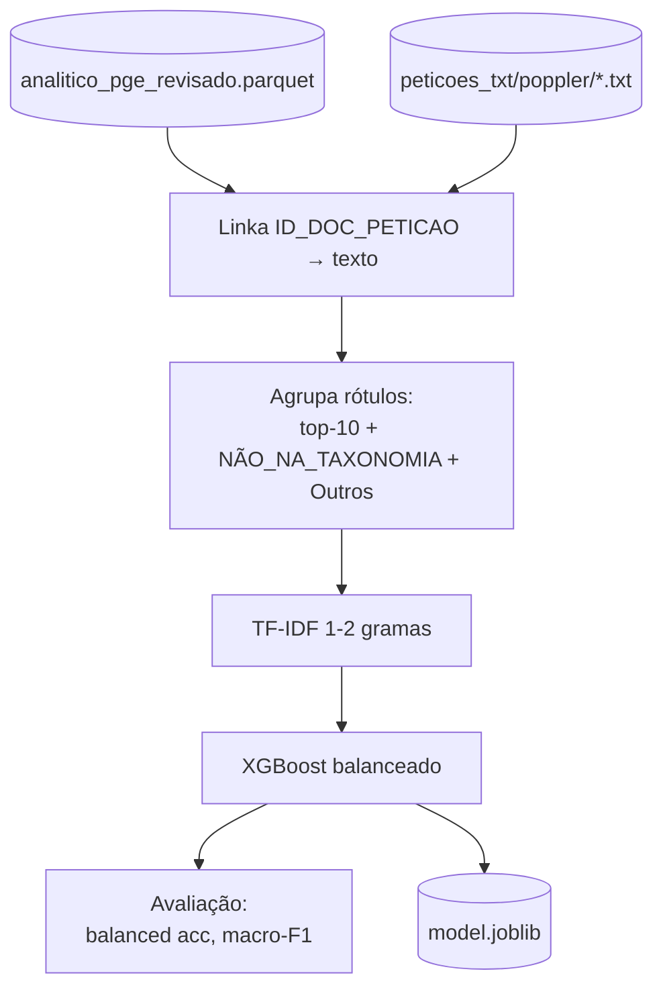

# Classificador de Assuntos Jurídicos — PGE-SP

Aplicativo **local** (Docker Compose) para classificação automática de assuntos
de petições iniciais da **Procuradoria Geral do Estado de São Paulo (PGE-SP)**,
desenvolvido com o **Insper** no âmbito do projeto FAPESP.

O modelo é ajustado à **taxonomia revisada** da PGE (do repositório
[`classificador-assuntos`](https://github.com/prointe-insper/classificador-assuntos))
e segue a abordagem `tfidf_xgboost` do pacote
[juriclass](https://github.com/tiagoft/juriclass).

> 🔒 **LGPD:** toda a solução roda **100% local**, sem dependência de nuvem.
> Não há envio de dados para serviços externos.

---

## ✨ O que a ferramenta faz

A partir de um ou mais arquivos enviados pelo usuário (TXT, PDF nativo, PDF
escaneado ou imagem), o sistema:

1. **Extrai o texto** (com OCR automático para PDFs escaneados/imagens);
2. **Estrutura/limpa** o texto;
3. **Prediz** o assunto entre os **top-10 rótulos** da taxonomia + `NÃO_NA_TAXONOMIA`
   (peça fora da taxonomia) + `Outros`;
4. Mostra a **probabilidade de cada rótulo**;
5. Apresenta a **interpretabilidade** (termos mais influentes na decisão, via TreeSHAP);
6. Aplica um **limiar de corte** configurável: abaixo dele, a peça é marcada
   como **"Revisar manualmente"**.

### Classificação em lote, revisão e exportação

- **Upload múltiplo:** envie vários documentos de uma vez; o modelo roda para
  cada um, com **barra de progresso** (N de M).
- **Tabela de resultados:** documento, rótulo predito, confiança e a marca de
  *revisar manual* (recalculada ao vivo conforme o limiar). Cada linha pode ser
  expandida para ver as probabilidades e a explicação (TreeSHAP).
- **Feedback humano:** marque cada classificação como **correta** ou
  **incorreta**; quando incorreta, escolha o **rótulo correto** num dropdown da
  taxonomia. O feedback acompanha a exportação (base para retreino futuro).
- **Exportar para Excel:** baixe um `.xlsx` com as classificações **e as colunas
  de feedback**. O nome do arquivo carrega um **timestamp**
  (`classificacoes_AAAAMMDD_HHMMSS.xlsx`), permitindo salvar vários históricos.
- **Seletor de modelo:** a interface já traz um seletor de modelo (hoje com um
  único modelo), preparado para múltiplas opções no futuro.

---

## 🏗️ Arquitetura



### Pipeline de uma requisição



---

## 🚀 Como rodar localmente

### Pré-requisitos
- [Docker](https://docs.docker.com/get-docker/) + Docker Compose.
- O artefato do modelo em `backend/model/artifacts/model.joblib`
  (treine-o — veja [Treino](#-treino-do-modelo) — ou baixe das Releases).

### 1. Obter o modelo

```bash
# Opção A: baixar de uma Release do GitHub
cd backend
uv run python -m model.download_model \
    --url https://github.com/prointe-insper/classificador-app/releases/download/v0.1.0/model.joblib

# Opção B (futuro): baixar do Hugging Face
uv run python -m model.download_model --hf prointe-insper/classificador-assuntos-pge

# Opção C: treinar localmente (veja seção Treino)
```

### 2. Subir tudo com Docker Compose

```bash
cp .env.example .env       # ajuste se necessário
docker compose up --build
```

Acesse **http://localhost:8080**. A API fica em **http://localhost:8000**
(docs interativas em `http://localhost:8000/docs`).

### Modo desenvolvimento (sem Docker)

```bash
# Backend
cd backend
uv sync
uv run uvicorn app.main:app --reload --port 8000

# Frontend (outro terminal)
cd frontend
npm install
npm run dev        # http://localhost:5173 (proxy /api → :8000)
```

---

## 🧠 O modelo

| Item | Valor |
| --- | --- |
| Abordagem | TF-IDF (1–2 gramas) + **XGBoost** (`tree_method=hist`, `multi:softprob`) |
| Inspiração | `tfidf_xgboost` do [juriclass](https://github.com/tiagoft/juriclass) |
| Alvo | `PGE_ASSUNTOS_REVISADA` — **top-10** + `NÃO_NA_TAXONOMIA` + `Outros` (12 classes) |
| Balanceamento | pesos de classe (`class_weight="balanced"`) durante o treino |
| Explicabilidade | **TreeSHAP** (exato p/ árvores) — mapeia features TF-IDF → termos do documento |
| Distribuição | `model.joblib` (vectorizer + clf + rótulos + metadados) |

### Por que TF-IDF + XGBoost (e não um transformer)?

Por restrição de **LGPD**, não podemos usar nuvem (Colab, APIs). A abordagem
TF-IDF + XGBoost roda **inteiramente em CPU**, em qualquer máquina, sem GPU,
mantendo boa acurácia e — graças ao TreeSHAP — **explicabilidade exata e
instantânea** (ao contrário do LIME, que é amostral e lento). Um caminho com
SBERT/transformer (também presente no juriclass) fica registrado como evolução
futura, caso uma GPU local seja disponibilizada.

### Resultados esperados

<!-- METRICS:START -->
Avaliação no **conjunto de teste** (23.459 documentos, mantendo a **distribuição
real** dos assuntos; treino com 31.223 documentos, subamostrando as classes
majoritárias). Métricas detalhadas em `backend/model/artifacts/metrics.json`.

| Métrica global | Valor |
| --- | --- |
| **Balanced accuracy** | **0,914** |
| **Macro F1** | **0,793** |
| **Accuracy** | **0,808** |

Desempenho por classe (F1 / precisão / recall):

| Classe | F1 | Precisão | Recall | Suporte |
| --- | ---: | ---: | ---: | ---: |
| ICMS Declarado | 0,99 | 0,99 | 0,98 | 3.887 |
| IPVA | 0,98 | 0,98 | 0,99 | 489 |
| Cumprimento Individual de Coletiva 0017872-93.2005 (ATS) | 0,96 | 0,93 | 0,98 | 862 |
| Cumprimento individual de coletiva 1001391-23.2014 (ALE) | 0,92 | 0,88 | 0,97 | 929 |
| ICMS Autuação | 0,89 | 0,82 | 0,97 | 498 |
| Sistema Remuneratório – Bonificação por Resultados | 0,83 | 0,74 | 0,96 | 710 |
| Outros | 0,80 | 0,96 | 0,69 | 12.143 |
| NÃO_NA_TAXONOMIA | 0,71 | 0,61 | 0,84 | 1.280 |
| Detran – AIT (infração administrativa) | 0,69 | 0,54 | 0,97 | 480 |
| Sistema Remuneratório – GESS LC 1.157/11 | 0,66 | 0,51 | 0,94 | 554 |
| Sistema Remuneratório – Recálculo quinquênio/sexta-parte | 0,55 | 0,41 | 0,82 | 1.052 |
| Sistema Remuneratório – Licença-prêmio em pecúnia | 0,54 | 0,40 | 0,86 | 575 |

**Leitura dos resultados:**
- Assuntos com vocabulário muito distintivo (ICMS, IPVA, cumprimentos de
  coletivas identificadas por nº de processo) atingem F1 ≥ 0,92.
- As subclasses de *Sistema Remuneratório* são as mais confundidas **entre si**
  (alta recall, menor precisão) — são juridicamente próximas. O **limiar de
  corte** encaminha esses casos de menor confiança para revisão humana.
- `Outros` tem **alta precisão (0,96)** e recall menor (0,69): o modelo é
  conservador antes de descartar uma peça como "cauda longa".

> Treino em **CPU**, 8 núcleos, ~3 min (sem GPU).
<!-- METRICS:END -->

> A classe `Outros` concentra a cauda longa da taxonomia (muitos rótulos raros),
> por isso é majoritária. O **limiar de corte** existe justamente para encaminhar
> à revisão humana os casos de baixa confiança, priorizando precisão sobre
> cobertura quando necessário.

### Explicabilidade

Para a classe escolhida, calculamos os **valores SHAP** de cada *feature* TF-IDF
e destacamos os **termos presentes no documento** com maior contribuição. No
frontend, eles aparecem como *chips* coloridos (vermelho = empurra para a classe;
cinza = contra), dimensionados pela magnitude.

---

## 🎓 Treino do modelo

O treino lê o `analitico_pge_revisado.parquet` e os textos das petições do
repositório `classificador-assuntos` (que deve estar clonado ao lado deste).

```bash
cd backend
uv sync --group train
uv run python -m model.training.train \
    --data-parquet ../../classificador-assuntos/data/nova-taxonomia/analitico_pge_revisado.parquet \
    --texts-dir   ../../classificador-assuntos/data/peticoes_txt/poppler \
    --top-n 10 \
    --max-per-class 3000 \
    --n-estimators 100 --max-depth 6 --max-features 8000 \
    --learning-rate 0.3 --max-bin 128 \
    --out-dir model/artifacts
```

Esses hiperparâmetros foram calibrados para treinar em **CPU em ~3 minutos**
mantendo balanced accuracy ≈ 0,91. `--max-per-class` subamostra apenas o
**treino** das classes majoritárias (o teste preserva a distribuição real).

Saídas em `backend/model/artifacts/`: `model.joblib`, `metadata.json`,
`metrics.json`. Os textos são cacheados em `model/_cache_dataset.pkl` (primeira
execução lê ~117k arquivos em ~8 min; re-treinos reusam o cache em segundos).



---

## 📦 Distribuição do modelo (Releases / Hugging Face)

O binário do modelo **não é versionado no git**. Ele é publicado nas **Releases**
do repositório e, futuramente, no **Hugging Face Hub**.

```bash
# Gerar o pacote pronto para o HF (model card, inference.py, requirements):
cd backend
uv run python -m model.export_hf      # cria ../hf_export/

# Publicar (quando autorizado):
huggingface-cli upload prointe-insper/classificador-assuntos-pge hf_export .
```

---

## 🧪 Testes

```bash
# Backend (pytest)
cd backend && uv run pytest

# Frontend (vitest + React Testing Library)
cd frontend && npm run test

# E2E (Playwright)
cd frontend && npx playwright install chromium && npm run e2e
```

---

## 📁 Estrutura do projeto

```
classificador-app/
├── docker-compose.yml
├── backend/                 # FastAPI (uv)
│   ├── app/
│   │   ├── main.py          # app factory + lifespan
│   │   ├── config.py        # settings (APP_*)
│   │   ├── schemas.py       # contratos Pydantic
│   │   ├── dependencies.py  # singleton do modelo
│   │   ├── api/routes.py    # /health /labels /models /model-info /predict /export-xlsx
│   │   └── services/        # ocr, preprocess, labels, model, models, explain, pipeline, export
│   ├── model/
│   │   ├── training/train.py
│   │   ├── download_model.py
│   │   ├── export_hf.py
│   │   └── artifacts/       # model.joblib (não versionado)
│   └── tests/               # pytest
└── frontend/                # React + Vite + TS
    ├── src/
    │   ├── components/       # MultiFileUpload, ModelSelector, ProgressBar, ResultsTable, ResultCard, ProbabilityBars, Explanation, ...
    │   ├── api/client.ts
    │   └── styles/           # tema Insper/PGE
    ├── tests · src/**/*.test.tsx (vitest)
    └── e2e/                  # Playwright
```

---

## 🎨 Identidade visual

Estilo institucional, limpo e objetivo, alinhado ao **manual de marca do Insper**
(vermelho `#E4002B`) e ao tom institucional da **PGE-SP** (azul `#0a3d62`),
priorizando clareza e ausência de excessos.

---

## 🔭 Evolução futura
- Publicação do modelo no Hugging Face Hub.
- Variante SBERT/transformer (juriclass) caso GPU local seja disponibilizada.
- Classificação hierárquica (matéria → assunto) e multi-rótulo.
