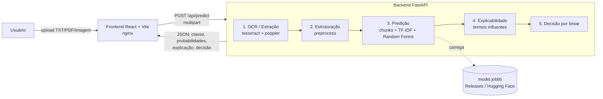
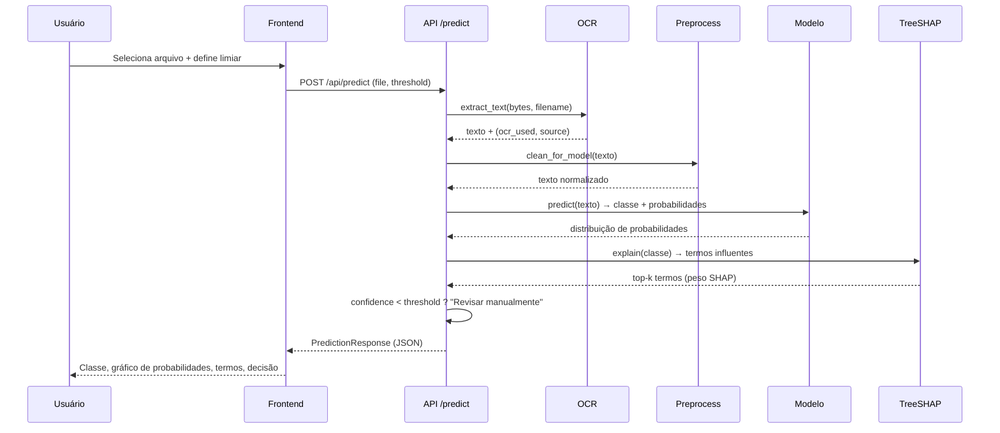
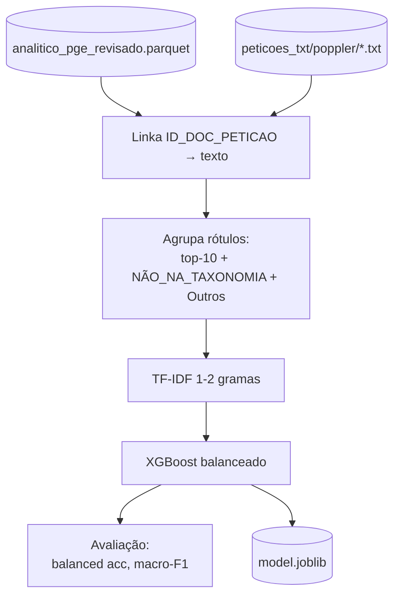

# Classificador de Assuntos Jurídicos — PGE-SP

[](https://zenodo.org/badge/latestdoi/1269512938)
[](LICENSE)

Aplicativo **local** (Docker Compose) para classificação automática de assuntos
de petições iniciais da **Procuradoria Geral do Estado de São Paulo (PGE-SP)**,
desenvolvido com o **Insper** no âmbito do projeto FAPESP.

O modelo é ajustado à **taxonomia revisada** da PGE (do repositório
[`classificador-assuntos`](https://github.com/prointe-insper/classificador-assuntos))
e vem do benchmark do [`juriclass`](https://github.com/prointe-insper/juriclass):
desde a v0.3.0, a configuração `fixed_chunks/tfidf/random_forest`.

> **LGPD:** toda a solução roda **100% local**, sem dependência de nuvem.
> Não há envio de dados para serviços externos.

---

## O que a ferramenta faz

A partir de um ou mais arquivos enviados pelo usuário (TXT, PDF nativo, PDF
escaneado ou imagem), o sistema:

1. **Extrai o texto** (com OCR automático para PDFs escaneados/imagens);
2. **Estrutura/limpa** o texto;
3. **Prediz** o assunto entre os **16 rótulos** cobertos pelo modelo atual;
4. Mostra a **probabilidade de cada rótulo**;
5. Apresenta a **interpretabilidade** (termos mais influentes na decisão);
6. Aplica um **limiar de corte** configurável: abaixo dele, a peça é marcada
   como **"Revisar manualmente"**.

### Classificação em lote, revisão e exportação

- **Upload múltiplo:** envie vários documentos de uma vez; o modelo roda para
  cada um, com **barra de progresso** (N de M).
- **Tabela de resultados:** documento, rótulo predito, confiança e a marca de
  *revisar manual* (recalculada ao vivo conforme o limiar). Cada linha pode ser
  expandida para ver as probabilidades e a explicação (TreeSHAP).
- **Feedback humano:** marque cada classificação como **correta** ou
  **incorreta**; quando incorreta, escolha o **rótulo correto** num dropdown da
  taxonomia. O feedback acompanha a exportação (base para retreino futuro).
- **Exportar para Excel:** baixe um `.xlsx` com as classificações **e as colunas
  de feedback**. O nome do arquivo carrega um **timestamp**
  (`classificacoes_AAAAMMDD_HHMMSS.xlsx`), permitindo salvar vários históricos.
- **Seletor de modelo:** a interface já traz um seletor de modelo (hoje com um
  único modelo), preparado para múltiplas opções no futuro.

---

## Arquitetura



### Pipeline de uma requisição



---

## Como rodar localmente

### Pré-requisitos
- [Docker](https://docs.docker.com/get-docker/) + Docker Compose.
- O artefato do modelo em `backend/model/artifacts/model.joblib`
  (treine-o — veja [Treino](#-treino-do-modelo) — ou baixe das Releases).

### 1. Obter o modelo

```bash
# Opção A: baixar de uma Release do GitHub
cd backend
uv run python -m model.download_model \
    --url https://github.com/prointe-insper/classificador-app/releases/download/v0.1.0/model.joblib

# Opção B (futuro): baixar do Hugging Face
uv run python -m model.download_model --hf prointe-insper/classificador-assuntos-pge

# Opção C: treinar localmente (veja seção Treino)
```

### 2. Subir tudo com Docker Compose

```bash
cp .env.example .env       # ajuste se necessário
docker compose up --build
```

Acesse **http://localhost:8080**. A API fica em **http://localhost:8000**
(docs interativas em `http://localhost:8000/docs`).

### Modo desenvolvimento (sem Docker)

```bash
# Backend
cd backend
uv sync
uv run uvicorn app.main:app --reload --port 8000

# Frontend (outro terminal)
cd frontend
npm install
npm run dev        # http://localhost:5173 (proxy /api → :8000)
```

---

## O modelo

| Item | Valor |
| --- | --- |
| Abordagem | *chunks* fixos de 100 palavras (sobreposição 50) → TF-IDF (unigramas, 5.000 features) → média dos vetores → **Random Forest** (200 árvores) |
| Origem | configuração `fixed_chunks/tfidf/random_forest`, vencedora do benchmark `project1_core` do [juriclass](https://github.com/prointe-insper/juriclass) |
| Alvo | `PGE_ASSUNTOS_REVISADA` — **16 assuntos** da taxonomia revisada |
| Explicabilidade | peso TF-IDF do documento × importância global do Random Forest |
| Distribuição | `model.joblib` (vectorizer + clf + rótulos + metadados) nas *Releases* |

O `metadata` do bundle descreve o pipeline de inferência (`chunking`,
`preprocess`, `explanation`), e o backend o reproduz a partir dessas chaves. É
o que garante que a resposta da API seja idêntica à do
[`juriclass-webapp`](https://github.com/prointe-insper/juriclass-webapp), que
serve o mesmo modelo.

> **Atenção à mudança de taxonomia na v0.3.0.** As 16 classes deste modelo são
> **inteiramente distintas** das 12 da v0.2.x: saíram os assuntos de massa
> (ICMS Declarado, IPVA, GESS, ALE, ATS) e entrou a cauda longa (Usucapião,
> IPTU, ITCMD, erro médico, terceirização). Também **não há mais** as classes
> de escape `Outros` e `NÃO_NA_TAXONOMIA`: toda peça é atribuída a um dos 16
> assuntos, e o **limiar de corte** passa a ser o único mecanismo que encaminha
> à revisão humana o que está fora do alcance do modelo. Peças de assunto de
> massa tendem a sair com confiança baixa, e é assim que devem ser tratadas.

### Por que uma abordagem leve (e não um transformer)?

Por restrição de **LGPD**, não podemos usar nuvem (Colab, APIs). TF-IDF com
classificador de árvores roda **inteiramente em CPU**, em qualquer máquina, sem
GPU, e no benchmark do `juriclass` superou tanto os modelos contextuais quanto
LLMs locais em *few-shot*, com custo de processamento muito menor. Entender
**por que** isso acontece é objeto de artigo próprio.

### Resultados esperados

<!-- METRICS:START -->
As métricas comparativas do modelo da v0.3.0 são as do benchmark `project1_core`
do [`juriclass`](https://github.com/prointe-insper/juriclass)
(`configs/benchmarks/project1_core.toml`), onde essa configuração foi escolhida
entre as demais. Elas **não são reproduzidas neste repositório**: aqui não está o
conjunto de avaliação, e publicar número sem o dado que o sustenta seria pior que
não publicar.

As métricas da v0.2.x (TF-IDF + XGBoost, 12 classes: balanced accuracy 0,914,
macro F1 0,793 e accuracy 0,808) seguem no histórico do git e valem para aquele
modelo, não para este.
<!-- METRICS:END -->

> Sem as classes de escape `Outros`/`NÃO_NA_TAXONOMIA`, o **limiar de corte** é
> o único mecanismo que encaminha à revisão humana os casos de baixa confiança,
> priorizando precisão sobre cobertura.

### Explicabilidade

Para o modelo atual, o peso de cada termo é o **peso TF-IDF no documento ×
importância global do Random Forest**, e destacamos os termos de maior peso. É a
mesma aproximação do `juriclass-webapp`: mede "o documento tem esse termo"
combinado com "esse termo importa para o modelo em geral", e **não** a
contribuição para a classe prevista especificamente. TreeSHAP exato sobre uma
floresta de 200 árvores e 5.000 features é caro demais para o tempo de resposta
de um upload; ele continua no código e é usado automaticamente por bundles
XGBoost (chave `explanation` do `metadata`). No frontend os termos aparecem como
*chips* coloridos, dimensionados pela magnitude.

---

## Treino do modelo

O treino lê o `analitico_pge_revisado.parquet` e os textos das petições do
repositório `classificador-assuntos` (que deve estar clonado ao lado deste).

```bash
cd backend
uv sync --group train
uv run python -m model.training.train \
    --data-parquet ../../classificador-assuntos/data/nova-taxonomia/analitico_pge_revisado.parquet \
    --texts-dir   ../../classificador-assuntos/data/peticoes_txt/poppler \
    --top-n 10 \
    --max-per-class 3000 \
    --n-estimators 100 --max-depth 6 --max-features 8000 \
    --learning-rate 0.3 --max-bin 128 \
    --out-dir model/artifacts
```

Esses hiperparâmetros foram calibrados para treinar em **CPU em ~3 minutos**
mantendo balanced accuracy ≈ 0,91. `--max-per-class` subamostra apenas o
**treino** das classes majoritárias (o teste preserva a distribuição real).

Saídas em `backend/model/artifacts/`: `model.joblib`, `metadata.json`,
`metrics.json`. Os textos são cacheados em `model/_cache_dataset.pkl` (primeira
execução lê ~117k arquivos em ~8 min; re-treinos reusam o cache em segundos).



---

## Distribuição do modelo (Releases / Hugging Face)

O binário do modelo **não é versionado no git**. Ele é publicado nas **Releases**
do repositório e, futuramente, no **Hugging Face Hub**.

```bash
# Gerar o pacote pronto para o HF (model card, inference.py, requirements):
cd backend
uv run python -m model.export_hf      # cria ../hf_export/

# Publicar (quando autorizado):
huggingface-cli upload prointe-insper/classificador-assuntos-pge hf_export .
```

---

## Testes

```bash
# Backend (pytest)
cd backend && uv run pytest

# Frontend (vitest + React Testing Library)
cd frontend && npm run test

# E2E (Playwright)
cd frontend && npx playwright install chromium && npm run e2e
```

---

## Estrutura do projeto

```
classificador-app/
├── docker-compose.yml
├── backend/                 # FastAPI (uv)
│   ├── app/
│   │   ├── main.py          # app factory + lifespan
│   │   ├── config.py        # settings (APP_*)
│   │   ├── schemas.py       # contratos Pydantic
│   │   ├── dependencies.py  # singleton do modelo
│   │   ├── api/routes.py    # /health /labels /models /model-info /predict /export-xlsx
│   │   └── services/        # ocr, preprocess, labels, model, models, explain, pipeline, export
│   ├── model/
│   │   ├── training/train.py
│   │   ├── download_model.py
│   │   ├── export_hf.py
│   │   └── artifacts/       # model.joblib (não versionado)
│   └── tests/               # pytest
└── frontend/                # React + Vite + TS
    ├── src/
    │   ├── components/       # MultiFileUpload, ModelSelector, ProgressBar, ResultsTable, ResultCard, ProbabilityBars, Explanation, ...
    │   ├── api/client.ts
    │   └── styles/           # tema Insper/PGE
    ├── tests · src/**/*.test.tsx (vitest)
    └── e2e/                  # Playwright
```

---

## Identidade visual

Estilo institucional, limpo e objetivo, alinhado ao **manual de marca do Insper**
(vermelho `#E4002B`) e ao tom institucional da **PGE-SP** (azul `#0a3d62`),
priorizando clareza e ausência de excessos.

---

## Evolução futura
- Publicação do modelo no Hugging Face Hub.
- Variante SBERT/transformer (juriclass) caso GPU local seja disponibilizada.
- Classificação hierárquica (matéria → assunto) e multi-rótulo.

---

## Como citar

Cada release publicada é arquivada no **Zenodo**, que gera um **DOI** permanente
e citável. O badge no topo do README sempre aponta para a versão mais recente.

- **DOI conceitual** (sempre a versão mais recente): [10.5281/zenodo.20815006](https://doi.org/10.5281/zenodo.20815006)
- **Registro no Zenodo**: https://zenodo.org/records/20815006

Para citar, use os metadados do arquivo [`CITATION.cff`](CITATION.cff) (o GitHub
exibe o botão "Cite this repository" a partir dele) ou a entrada do registro no
Zenodo. Exemplo de citação:

> Trecenti, Julio. *Classificador de Assuntos Jurídicos PGE-SP*. Insper, 2026.
> https://doi.org/10.5281/zenodo.20815006

Para citar uma versão específica, use o DOI daquela versão informado na página do
Zenodo (por exemplo, a v0.2.1 tem o DOI 10.5281/zenodo.20815007).

---

## Licença

Distribuído sob a licença **MIT**. Veja o arquivo [`LICENSE`](LICENSE) para os
termos completos.
